EXERCICE COURS PROGRAMMATION ANDROID : FRAGMENTS

Lien vers le code sur Github :

[https://github.com/NouhailaAbdtouirsi/Fragment_Based_App_Android_Studio_JA ](https://github.com/NouhailaAbdtouirsi/Fragment_Based_App_Android_Studio_JAVA.git)VA.git

Structure du projet :

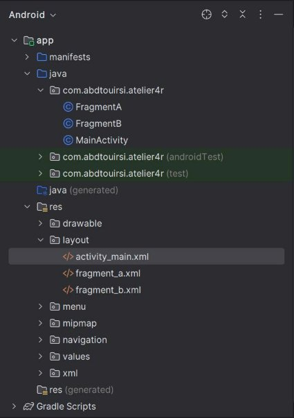

Étapes :

Créer un projet avec deux fragments, nommés fragment A et fragment B, Chaque fragment doit avoir un fichier layout associé.

FragmentA :![ref1]![ref2]

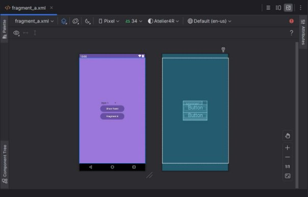

FragmentB :![ref1]![ref2]

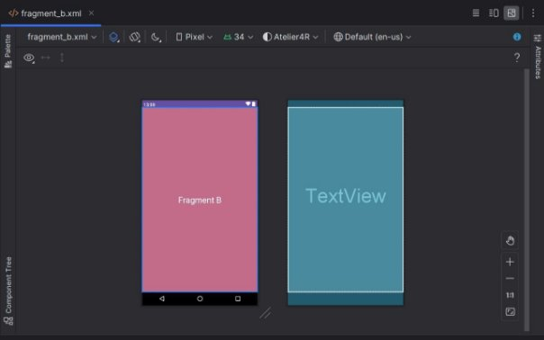Pour associer les deux fragments avec l activité main il faut creer un a**ndroidx.fragment.app.FragmentContainerView** qui va contenir les deux fragments :

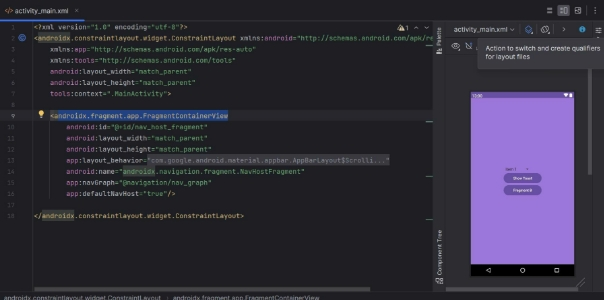

Avec le code java :

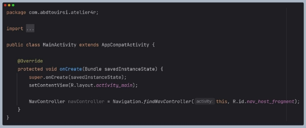

Ajouter la navigation entre les fragments en utilisant un menu de navigation en bas de l'écran.

\- Pour l’ajouter il faut créer les deux fichiers l’un de navigation et l autre contiendra les éléments du menu :

Fichier menu :![ref1]![ref2]

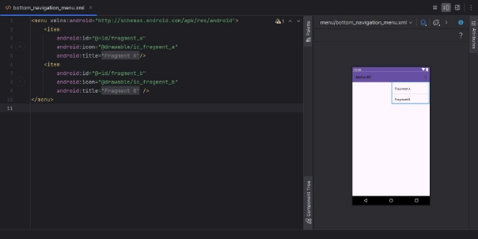

Fichier navigation :

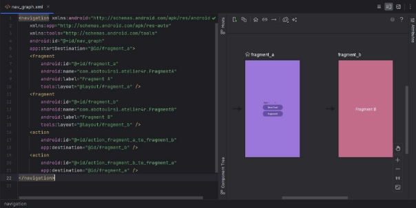

Puis ajouter au fichier XML de l’activité main le code qui va associé le menu avec l activité :![ref1]![ref2]

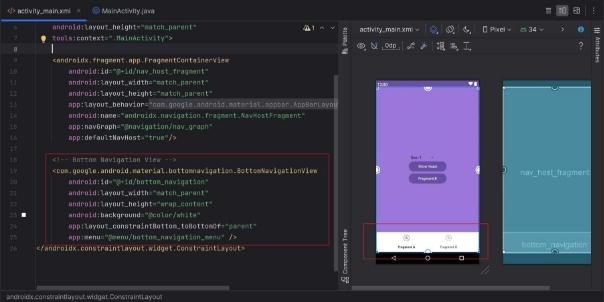

Avec le code java pour gérer la navigation :

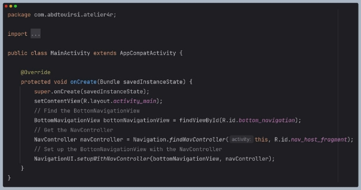

Le FragmentA contient une liste déroulante (Spinner) et un bouton avec un gestionnaire d'événements pour afficher un message toast lorsqu'il est cliqué.

Les éléments du Spinner je les ai déclarer dans le fichier XML :![ref1]![ref2]

Puis pour les récupérer dans FragmentA.java on utilise le code encadrer avec le rouge

De même pour afficher l’élément sélectionné on utilise le code encadrer avec le vert

Et pour naviger du fragment A vers le fragment B on utilise le code encadrer avec le bleu![ref1]![ref2]

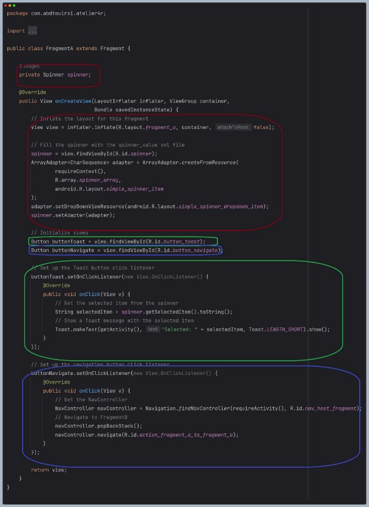

Résultat :

Le message du toast indiquant l’element sélectionné :![ref1]![ref2]

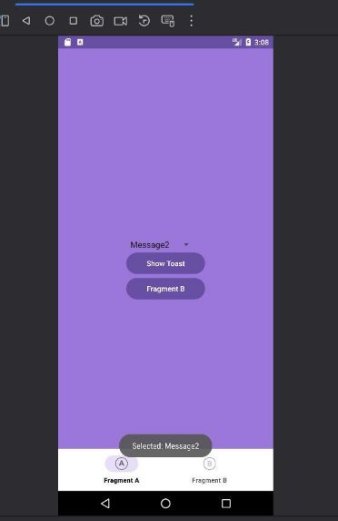

Le fragment B accessible soit via le bouton qui est a l intérieur du Fragment A ou le bouton de navigation FragmentB :![ref1]![ref2]

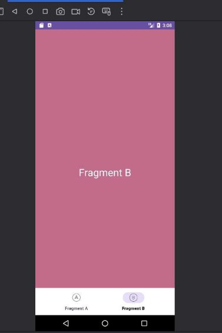
NOUHAILA ABDTOUIRSI 9

[ref1]: app/Capture/Aspose.Words.ecdf4a94-8d65-4382-9479-d27730422067.003.png
[ref2]: app/Capture/Aspose.Words.ecdf4a94-8d65-4382-9479-d27730422067.004.png
